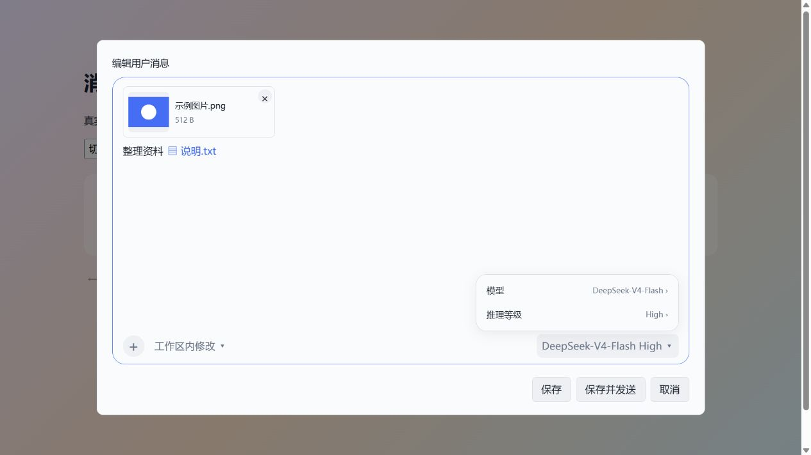

# dsh-plugin-message-edit

让 DeepSeek Harness 桌面端的历史消息像输入框一样可以修改，支持正文、附件、文件引用和模型设置。

## 作用

- **用户消息「保存」**：在原会话修改正文和附件，保留已有回复与后续对话，不再次请求模型。
- **用户消息「保存并发送」**：携带修改后的内容创建新分支，重新请求模型；原会话可以切回。
- **附件和引用**：通过「+」、粘贴或拖入添加文件，支持移除和替换；图片点击放大，普通文件和蓝色文件引用使用系统默认程序打开。
- **编辑与重试**：编辑助手回复或思考、重生成最后回复、重试历史回合；通过 Timeline 查看记录、切换版本。
- **完整编辑框**：支持 `@` 文件与会话引用、权限、模型和推理等级选择，以及取消编辑的二次确认。

当前验证版本：**DSH 桌面端 `0.2.0-rc.2`**。其他版本需要另行验证；首次打开会话时请等待历史消息加载完成。



*截图来自本地示例页面，使用演示内容。*

## 使用方法

### 安装

从 npm 安装：

```sh
dsh plugin --profile desktop add -w @sh1robana/dsh-plugin-message-edit
```

或通过 GitHub Release 的预构建安装包安装：

```sh
dsh plugin --profile desktop add -w https://github.com/sh1robana/dsh-plugin-message-edit/releases/download/v0.3.0/dsh-plugin-message-edit-0.3.0.tgz
```

Windows 桌面端没有全局 `dsh` 命令时，使用安装目录里的 CLI，按实际安装位置修改路径：

```powershell
& 'D:\DeepSeek Harness\resources\runtime\cli\bin\dsh.cmd' plugin --profile desktop add -w https://github.com/sh1robana/dsh-plugin-message-edit/releases/download/v0.3.0/dsh-plugin-message-edit-0.3.0.tgz
```

**安装后保存工作，彻底退出 DSH，再重新启动。** 如果已安装旧的 `dsh-message-edit` 或其他消息编辑插件，请先停用，避免重复按钮和接口冲突。迁移本项目旧版时，可先执行 `dsh plugin --profile desktop remove -w dsh-message-edit`。

### 编辑

1. 打开已有会话，点击消息操作栏的编辑按钮，或进入 **Timeline** 选择消息。
2. 修改正文；点击 **「+」** 添加文件，也可以直接粘贴、拖入。点击附件的 **「×」** 移除，点击图片查看大图。
3. 需要时修改权限、模型或推理等级，然后选择 **「保存」** 或 **「保存并发送」**。
4. 点击 **「取消」**，在「是否确认取消编辑」中选择「是」放弃修改，选择「否」继续编辑。

用户编辑框快捷键：`Ctrl+S` 仅保存，`Enter` 保存并发送，`Shift+Enter` 换行；输入法组字时不会提交。

助手消息编辑会创建新版本。版本切换不会撤销已经执行的文件修改或命令；被压缩移出模型上下文的用户消息无法原地保存，可使用「保存并发送」。

## 贡献与致谢

- **[shirobana](https://github.com/sh1robana)**：需求设计、桌面验收与项目维护。
- **Codex（OpenAI AI 编程助手）**：协作完成兼容适配、功能实现、测试和文档。

基于 [Moeblack/dsh-message-edit](https://github.com/Moeblack/dsh-message-edit) 继续开发；感谢 [DDDMUC/dsh-edit-turn](https://github.com/DDDMUC/dsh-edit-turn) 的设计参考、DeepSeek Harness 的插件接口与构建预设，以及 [dsh-market](https://github.com/dsh-market/dsh-market)、[awesome-dsh-plugin](https://github.com/awesome-dsh-plugin/awesome-dsh-plugin) 社区的发布文档。

以 MIT 许可发布。来源与许可见 [NOTICE.md](NOTICE.md) 和 [LICENSE](LICENSE)；开发与发布步骤见 [发布指南](docs/发布指南.md)。
